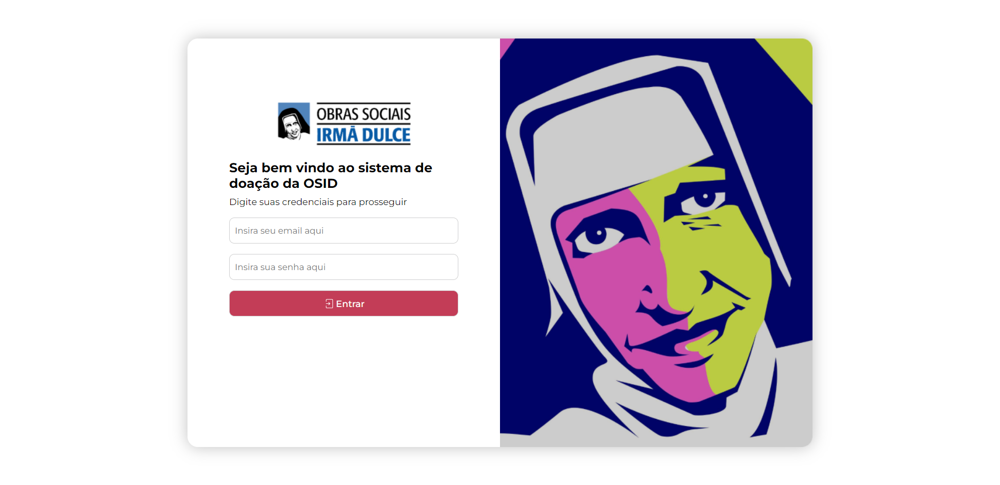

# Tela de Login (SisTID)- Hackathon+ OSID

Este projeto contém o código-fonte de uma tela de login desenvolvida como parte do Hackathon+ OSID, um programa de dinâmicas imersivas que incentiva a criação de projetos inovadores para resolver problemas reais. O evento é realizado em parceria entre as Obras Sociais Irmã Dulce (OSID), a Rede+, o Sebrae e o Grupo Civil.

## Descrição

A tela de login foi projetada para ser utilizada como parte de um sistema integrado de gestão de doações, desenvolvido durante o Hackathon+ OSID. Através dessa tela, os usuários poderão autenticar-se para acessar funcionalidades e recursos do sistema.

## Funcionalidades

- Os usuários podem inserir seu e-mail e senha para fazer login no sistema.
- O botão "Entrar" permite aos usuários enviar suas credenciais e efetuar o login.
- O ícone do botão é animado quando o mouse passa por cima dele, alterando a cor do contorno.

## Tecnologias Utilizadas

O projeto foi desenvolvido utilizando as seguintes tecnologias:

- HTML
- CSS
- JavaScript

## Como Executar

Siga as etapas abaixo para executar a tela de login em seu ambiente local:

1. Faça o download ou clone este repositório.
2. Navegue até a pasta raiz do projeto.
3. Abra o arquivo "index.html" em um navegador web compatível.

## Participação no Hackathon+ OSID

Este projeto faz parte da minha participação no Hackathon+ OSID, uma maratona de desenvolvimento realizada em 16 a 28 de Junho. Durante o hackathon, os participantes foram desafiados a criar soluções inovadoras para melhorar a gestão de doações, criar um canal de vendas virtual integrado à operação e aprimorar a experiência das pessoas com a OSID.

## Agradecimentos

Gostaria de expressar meus agradecimentos à equipe organizadora do Hackathon+ OSID, às Obras Sociais Irmã Dulce (OSID), à Rede+, ao Sebrae e ao Grupo Civil por promoverem esse evento inspirador e proporcionarem a oportunidade de desenvolver soluções inovadoras para problemas reais.

## Contato

Para mais informações sobre este projeto ou sobre minha participação no Hackathon+ OSID, entre em contato:

Pamella Silva
pamellarebecabispo@gmail.com
pamella-silva-dev

Espero que este README forneça uma visão geral clara da tela de login desenvolvida durante o Hackathon+ OSID. Se tiver alguma dúvida ou precisar de mais informações, sinta-se à vontade para entrar em contato. Obrigado!